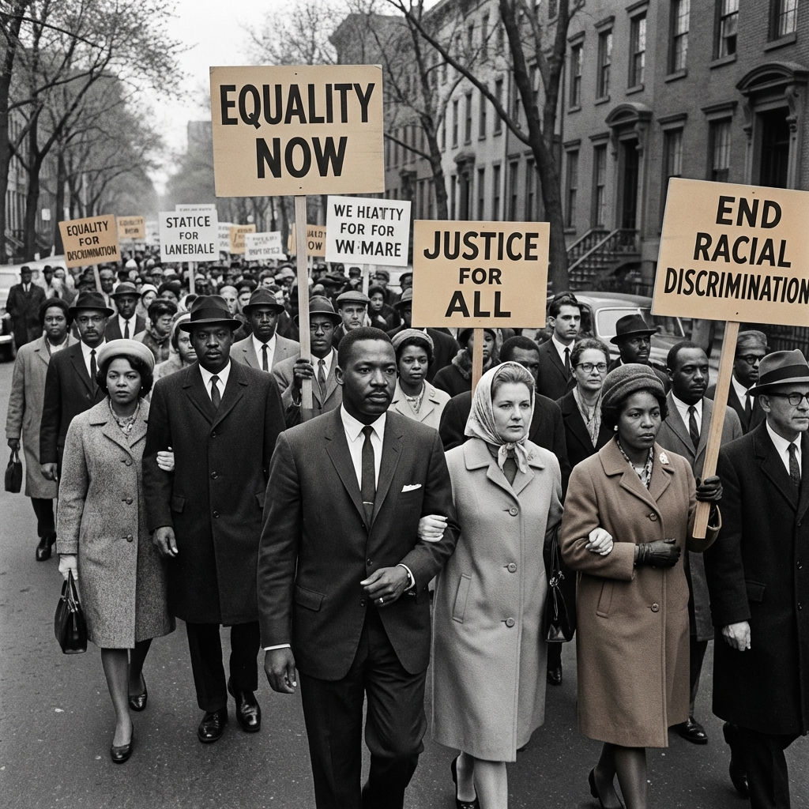

# RECI Reflection Gallery

An immersive, interactive gallery experience for exploring stories of race and social justice. Created for the **Center of Race and Social Problems** at the **Racial Equity Consciousness Institute**, University of Pittsburgh.



## ✨ Features

- **Four Immersive Templates**: Narrative, Documentary, Testimonial, and Analytical experiences
- **Interactive Components**: Audio players, image galleries, timelines, and reflection prompts
- **Responsive Design**: Beautiful on all devices, from desktop to mobile
- **Accessibility First**: Keyboard navigation, screen reader support, and WCAG compliant
- **Easy Content Management**: Simple JSON-based system for adding new reflections
- **University of Pittsburgh Branding**: Official colors and professional design

## 🚀 Quick Start

1. **Clone or download** this repository
2. **Open `index.html`** in a modern web browser
3. **Explore** the four sample reflection items

That's it! No build process or dependencies required.

## 📁 Project Structure

```
reflection-gallery/
├── index.html              # Main landing page
├── styles.css              # Design system and base styles
├── app.js                  # Main application logic
├── components/             # Reusable components
│   ├── carousel.js         # Horizontal scrolling carousel
│   ├── modal.js            # Fullscreen modal system
│   ├── audio-player.js     # Custom audio player
│   └── image-gallery.js    # Lightbox image viewer
├── templates/              # Immersive experience templates
│   ├── narrative.js        # Story-driven template
│   ├── documentary.js      # Factual/educational template
│   ├── testimonial.js      # Personal accounts template
│   ├── analytical.js       # Research/academic template
│   └── template-styles.css # Template-specific styles
├── data/
│   └── content.json        # Content configuration
├── assets/
│   ├── images/             # Image files
│   ├── audio/              # Audio files (optional)
│   └── video/              # Video files (optional)
└── docs/                   # Documentation
    ├── USER_GUIDE.md       # How to add content
    └── TEMPLATE_GUIDE.md   # Template customization
```

## 📖 Adding New Content

See the [User Guide](docs/USER_GUIDE.md) for detailed instructions on adding new reflection items.

**Quick overview:**

1. Add your images to `assets/images/`
2. Edit `data/content.json` to add a new item
3. Choose a template type: `narrative`, `documentary`, `testimonial`, or `analytical`
4. Refresh the page to see your new content

## 🎨 Template Types

### Narrative
Perfect for story-driven content with a timeline. Features parallax scrolling, timeline visualization, and reflection prompts.

### Documentary
Ideal for factual, educational content. Features split-screen layout with key highlights sidebar and data visualizations.

### Testimonial
Best for personal accounts and oral histories. Features audio player, pull quotes, and photo galleries.

### Analytical
Designed for research and academic content. Features table of contents, key findings, and discussion questions.

## 🌐 Browser Support

- Chrome/Edge (latest)
- Firefox (latest)
- Safari (latest)
- Mobile browsers (iOS Safari, Chrome Mobile)

## ♿ Accessibility

This gallery is built with accessibility in mind:

- Full keyboard navigation support
- Screen reader compatible
- ARIA labels and semantic HTML
- High contrast mode support
- Reduced motion support for users who prefer it

## 🎓 About RECI

The **Racial Equity Consciousness Institute (RECI)** is part of the Center of Race and Social Problems at the University of Pittsburgh. Our mission is to foster understanding, empathy, and action through education and immersive storytelling.

Learn more at [www.crsp.pitt.edu](https://www.crsp.pitt.edu)

## 📝 License

© 2026 University of Pittsburgh. All rights reserved.

## 🤝 Contributing

This gallery is designed to be easily customizable. See the [Template Guide](docs/TEMPLATE_GUIDE.md) for information on creating custom templates or modifying existing ones.

## 📧 Contact

For questions or support, please contact the Center of Race and Social Problems at the University of Pittsburgh.

---

**Built with ❤️ for racial equity and social justice**
